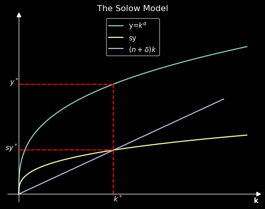

# New sources of GDP growth

For data manipulation, data cleaning and some data visualizations used Python. \
This repository includes a visualisation of the GDP/capita from 1970-2022 for specific countries and the Solow-Model with matplotlib.

